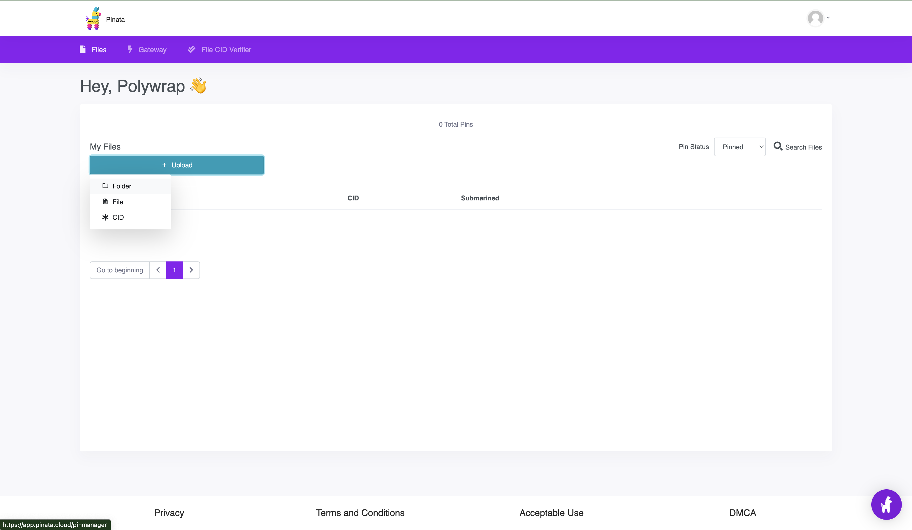
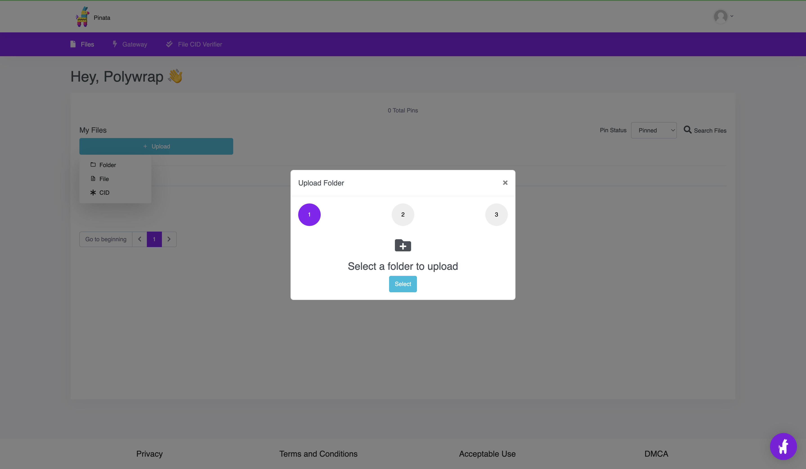

## **Introduction**

In this 5 step guide, we'll walk you through how to deploy your Polywrapper to [Pinata](https://www.pinata.cloud/) so that other dapps could integrate it into their dapps!

## **Table of Contents**
<details>
    <summary>Click to expand</summary>

  * [Introduction](#introduction)
  * [What you need to get started](#what-you-need-to-get-started)


</details>

### What is Pinata?


### What you need to get started:
* We'll be using the [Polywrap Demos](https://github.com/polywrap/demos) repo for this guide. 
* 💚 [Node. js](https://nodejs.org/en/) 
* ⚡ [Pinata Account](https://fleek.co/)
* 🐳 [Docker](https://www.docker.com/)
* 🧶[Yarn](https://classic.yarnpkg.com/en/)
    * Versions:  `node >=10.0.0` or `yarn >=1.0.0`
* 🔸 [Git](https://git-scm.com/downloads)


### Step 1. Clone the polywrap demo project  

```bash
git clone https://github.com/polywrap/demos.git
```

### Step 2. Git pull metadata
Then, we will check out the demo branch with the metafiles already set up:

```bash
git pull origin polywrap-metadata
```

### Step 3. Build the wrapper
Now, we can build the sample Polywrapper with the following commands:

```bash
nvm use
yarn
yarn build
```

Your `build` folder should be generated now. Copy and paste the `./web3api.meta.yaml` and `./meta` files into the `build` folder.

### Step 4.  **Upload the build folder to Pinata**

Make sure you signup for a Pinata account. 

* Click `"Upload"`


* Click `"Folder"`



* Click `Select`  for a folder to upload should be the build folder 



* Give your file or folder a name.
Example: Gm-Polywrap


* Click "Upload" from the alert message


### Step 5. 
